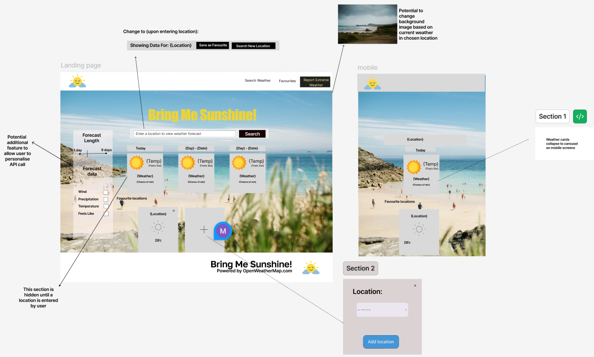

# Bring Me Sunshine

Deployed link:

## 📋 Project Overview

A project plan and outline:

-   Project workflow and repo setup
-   Creation of user stories
-   Wireframe skeleton and high priority features
-   Create kanban board of development issues
-   development, smoke testing, deployment
-   in situe testing, performance and improvements

## Project Goals

## User Stories

User story: As a First‑Time Visitor, I want a concise, clear, layout with consistent and familiar styling, so I can find weather information quickly and efficiently,

Features: 
 1. Navbar and Footer with navigation points around the site. 
 2. Header section showing title and search bar
 3. Main primary panel showing updated information for today in chosen location.

User story: As a Regular User, I would like customisability, and the ability to save my favourite locations, so I can personalise my experience.

1. Filters section where user can choose to show or hide different weather elements, for example wind speed, temperature and feels like temperature.
2. Quantity selector for user to choose number of days of forecast into the future the app shows with a maximum of 7 days to ensure smooth design is maintained.
3. Favourites panel at the bottom of screen to give user the ability to save favourite locations while continuing to search other spots.

User story: As a Site Owner, I want the site to follow accessibility best practices and responsive design, so everyone can access information.
1. Ensure sufficient contrast for clear visual display of fonts and buttons.
2. Supply text alternatives for images onsite.
3. User can submit using keyboard entry as well as mouse clicks.

User story: As a Site Owner, I want the site to follow development best practices, so it is secure and easy to maintain to minimize downtime.
1. Code is well commmented, with each function explained.
2. Variables are names appropriately and easy to find in relation to their purpose.
3. Indendation and formatting is consistent to make document easier to follow.

## Solution Design Details
 We focused on the idea of a sunny, beach themed design titled 'BringMeSunshine!' for the project. This resulted in a background page image of a sunny beach and a warm colour scheme of yellows and oranges. 

 Final Title Font:  

 Our wireframes reflect the intented features to fill our user stories:

 
## Testing

## Deployment and workflow

This project is deployed through github pages and follows a simplified agile gitflow methodology:

-   Each day of the project being considered one 'sprint'.
-   Main branch is preserved as the deployed and live branch, whilst all development work will be conducted on feature branches.
-   Code deployments to the live project environment will only available through a pull request to main. This enables a CI/CD approach.
-   All feautures must be tested on the 'develop' branch before being considered a release candidate to main.
    This ensures the deployed project maintains a stable codebase, and provides a scaleable workflow should the project scope increase and more developers were required to join the project.

Example of gitflow:

## Use of AI in development and project retrospective.

Ai used to create initial boilerplate from wireframe, streamlining bootstrap structuring. Due to fairly complex wireframe, this did have superfluous css classes that needed removed.

## Use of external resources

https://unsplash.com/ - For hero image assets

No other external code was used in this project.
